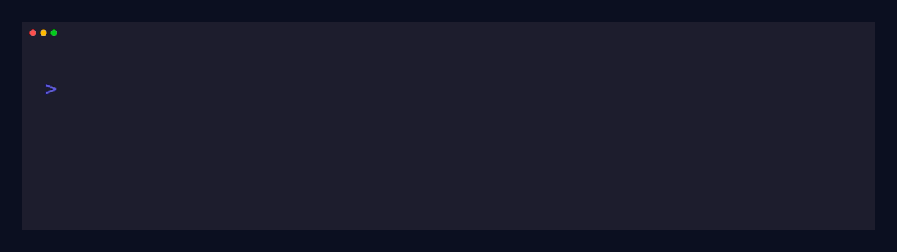
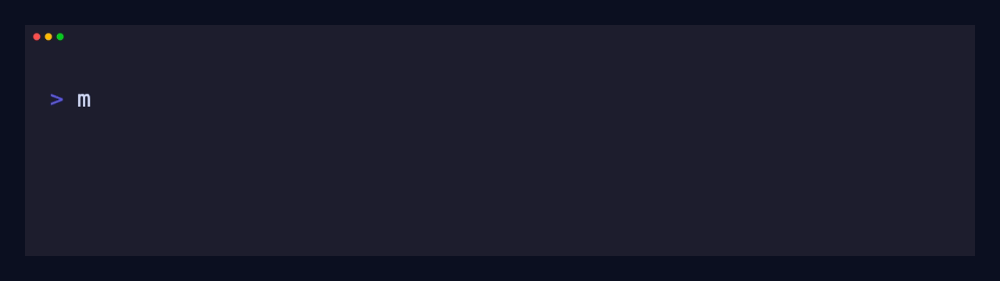
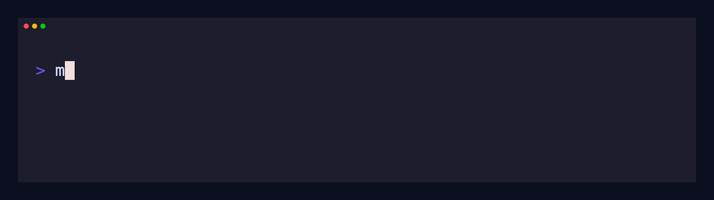

<p align="center">
  <strong>Make AI accountable. Own your data.</strong>
</p>

<h1 align="center">Matriosha</h1>

<p align="center">
  <code>encrypted</code> · <code>auditable</code> · <code>model-agnostic</code> · <code>local-first</code>
</p>

<p align="center">
  <a href="https://pypi.org/project/matriosha/"></a>
  <a href="https://pypi.org/project/matriosha/"></a>
  
  
</p>

```text
███╗   ███╗ █████╗ ████████╗██████╗ ██╗ ██████╗ ███████╗██╗  ██╗ █████╗
████╗ ████║██╔══██╗╚══██╔══╝██╔══██╗██║██╔═══██╗██╔════╝██║  ██║██╔══██╗
██╔████╔██║███████║   ██║   ██████╔╝██║██║   ██║███████╗███████║███████║
██║╚██╔╝██║██╔══██║   ██║   ██╔══██╗██║██║   ██║╚════██║██╔══██║██╔══██║
██║ ╚═╝ ██║██║  ██║   ██║   ██║  ██║██║╚██████╔╝███████║██║  ██║██║  ██║
╚═╝     ╚═╝╚═╝  ╚═╝   ╚═╝   ╚═╝  ╚═╝╚═╝ ╚═════╝ ╚══════╝╚═╝  ╚═╝╚═╝  ╚═╝
```

<p align="center">
  <strong>A Python CLI for an encrypted, auditable AI context engine.</strong>
</p>

<p align="center">
  
</p>

<table>
<tr>
<td width="33%" align="center">
<strong>Encrypted by default</strong><br>
Protected by hard math, not mutable platform promises.
</td>
<td width="33%" align="center">
<strong>Model agnostic</strong><br>
Keep memory outside the model provider.
</td>
<td width="33%" align="center">
<strong>Scalable when needed</strong><br>
Start local, then move to managed cloud for sync, custody, quotas, tokens, and agents.
</td>
</tr>
</table>

## Terminal demos

<table>
<tr>
<td width="50%">

### Initialize a vault



```bash
matriosha vault init
```

</td>
<td width="50%">

### Remember a file


```bash
matriosha memory remember --file ~/Documents/agent-notes/launch-context.md
```

</td>
</tr>
<tr>
<td width="50%">

### Search semantically


```bash
matriosha memory search 'What is the launch motto'
```

</td>
<td width="50%">

### Verify integrity



```bash
matriosha vault verify
```

</td>
</tr>
</table>

## Why Matriosha?

AI agents are getting longer memories, but most memory systems are opaque, vendor-bound, or hard to verify.

Matriosha is built around three principles:

- **Model agnostic**: keep memory outside the model provider.
- **Encrypted by default**: your data is protected by hard math, not by mutable platform promises.
- **Scalable when needed**: start local for €0, then move to safe managed cloud for key custody, sync, quotas, tokens, and agent workflows.

## Quickstart

Install Matriosha:

```bash
pip install matriosha
```

Initialize your encrypted local vault:

```bash
matriosha vault init
```

Remember a file:

```bash
matriosha memory remember --file ~/Documents/agent-notes/launch-context.md
```

Search semantically:

```bash
matriosha memory search 'What is the launch motto'
```

Verify vault integrity:

```bash
matriosha vault verify
```

## Modes

Matriosha supports two explicit modes.

### Local mode

Local mode is the default.

- €0
- offline-first
- no authentication required
- encrypted memory stays on your machine
- manual vault bootstrap with `matriosha vault init`

```bash
matriosha mode set local
matriosha vault init
matriosha memory remember "hello from local mode" --tag demo
matriosha memory search "hello"
matriosha vault verify
```

### Managed mode

Managed mode adds cloud-backed operational workflows for teams and production agents while keeping semantic local and safe.

- sync
- policy
- quota
- billing
- token workflows
- agent workflows

```bash
matriosha mode set managed
matriosha auth login
matriosha billing status
matriosha memory remember "hello from managed mode" --tag demo
matriosha vault sync
```

Managed mode automatically provisions managed key custody after successful authentication via email OTP. Managed users should not be asked to manually generate keys, copy key files, or manage crypto passphrases for normal managed workflows.

## Pricing

Local mode is free.

Managed mode is **€9/month** and includes:

- up to **3 agents**
- up to **3 GB** of managed storage

Need more agents or storage? Use managed add-ons / upgrade paths as your deployment grows.

The current CLI uses `--agent-pack-count 1` for the base managed plan.

Relevant commands:

```bash
matriosha billing status
matriosha billing subscribe --agent-pack-count 1
matriosha billing upgrade
matriosha billing cancel --yes
```

## Requirements

- Python `>=3.11,<3.15`
- A POSIX-like shell for the examples below
- Optional system tools for rich file extraction, installed through `matriosha init` where supported

## Command map

Top-level command groups:

```text
matriosha
├── mode
├── profile
├── auth
├── billing
├── audit
├── quota
├── vault
├── memory
├── token
├── agent
├── status
├── doctor
├── compress
├── delete
└── init
```

Common workflows:

```bash
matriosha status
matriosha doctor
matriosha quota status
matriosha memory list
matriosha memory recall <memory-id>
matriosha memory delete <memory-id> --yes
matriosha memory compress --deduplicate
matriosha token generate --local
matriosha agent list
```

Use `--json` for automation and agent integrations:

```bash
matriosha --json memory search "contract renewal"
```

JSON output is treated as a machine-readable contract. Human prompts and troubleshooting output must not corrupt JSON stdout.

## Agent tokens

Matriosha can issue local or managed tokens for agent workflows.

<p align="center">
  
</p>

```bash
matriosha token generate readme-demo-agent
```

Use real tokens carefully: they are gates to your data.

## Semantic interpreter support

Matriosha can return structured semantic envelopes for recalled files.

Built-in rich extraction targets common formats such as:

- text
- Markdown
- JSON
- CSV/TSV
- PDF
- images
- DOCX
- XLSX

Unknown or unsupported binary formats still return safe structured fallback metadata.

Optional decoder plugins can be added through the `matriosha.decoders` entry-point group.

## Install for development

```bash
git clone <repo-url>
cd matriosha
python -m venv .venv
source .venv/bin/activate
python -m pip install --upgrade pip
pip install -e ".[dev]"
```

Check the CLI:

```bash
matriosha --help
matriosha --version
```

## Testing and quality gates

Run the main local checks:

```bash
ruff check src tests scripts
mypy src/matriosha
pytest --cov=matriosha --cov-report=term-missing --cov-fail-under=70 -m "not managed"
bandit -q -r src/matriosha
pip-audit
```

Focused test examples:

```bash
pytest tests/test_cmd_billing.py
pytest tests/test_legacy_command_cleanup.py
```

Real managed/backend integration tests require credentials and are promoted to their own workflow in `.github/workflows/integration-tests.yml`.

## Repository guide

| Path | Purpose |
|---|---|
| `src/matriosha` | CLI and core implementation |
| `tests` | Unit and integration tests |
| `.github/workflows/quality-gates.yml` | Pull request quality gates |
| `.github/workflows/integration-tests.yml` | Real backend integration workflow |
| `docs/ci/integration-tests.workflow.yml` | Portable copy of the backend integration workflow |
| `docs/adr` | Architecture Decision Records |
| `DESIGN.md` | Product design and implementation notes |
| `SECURITY.md` | Security policy and reporting guidance |
| `CHANGELOG.md` | Release history |
| `LICENSE` | BSD 3-Clause license |

## Documentation

Start here:

- `README.md` for installation, usage, and command overview.
- `DESIGN.md` for product design and implementation notes.
- `SECURITY.md` for security expectations.
- `CHANGELOG.md` for release history.
- `docs/adr/README.md` for durable architecture/security decisions.
- `docs/DEPENDENCIES.md` for optional runtime dependency details.

## Python 3.14+ installation

For Python 3.14.4 and newer, some optional vector-stack dependencies may not have pre-built wheels yet on all platforms.

Recommended base-runtime installation:

```bash
pip install matriosha
```

If you need optional LanceDB/PyArrow features, install with the `vector` extra. Some optional vector-stack dependencies may lag behind the newest Python releases on some platforms.

## SSL certificate handling

Matriosha automatically bundles SSL certificates via `certifi`. No manual certificate installation is required, including on macOS Python 3.14+.

If you still encounter SSL errors:

```bash
pip install --upgrade certifi
```

## Development notes

- Keep local and managed mode behavior visibly distinct.
- Keep JSON stdout clean for automation.
- Do not reintroduce old top-level legacy commands such as `matriosha remember`, `matriosha recall`, `matriosha verify`, or `matriosha sync`.
- Prefer grouped commands such as `matriosha memory remember`, `matriosha memory recall`, `matriosha vault verify`, and `matriosha vault sync`.
